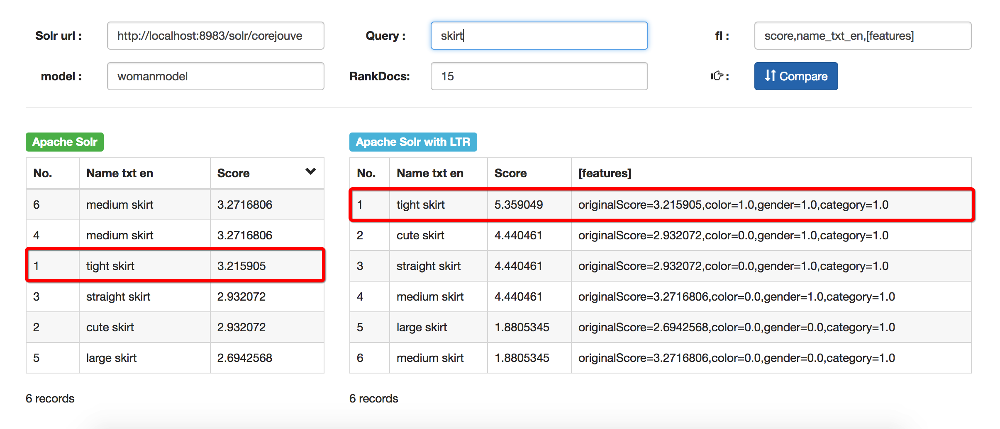
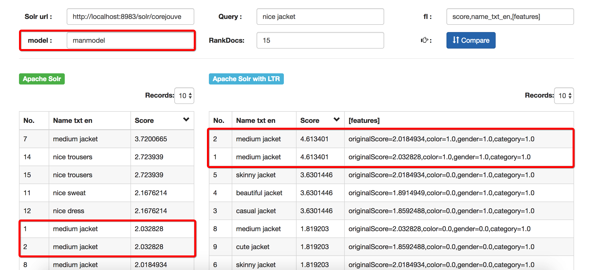

# Projet JOUVE (Apache Solr with LTR plugin)

## Introduction

Mettre en place un prototype basé sur les données d’un site e-commerce en utilisant le ou les modèles de « machine learning » présélectionnés au démarrage du projet par Jouve.

Pour les modèles de « machine learning » : Soit utiliser les nouvelles fonctionnalités de « machine learning » intégrées au cœur de la dernière version du moteur de recherche Apache Solr  6.2, soit intégrer le module Apache Solr « Learning to rank ».

En mettant en œuvre le prototype, les étudiants devront comparer les résultats d’un ranking traditionnel basé uniquement sur la pertinence du contenu des documents avec les fonctionnalités mises en place.

```bash
├── GenTrainingDataSolr // generate training data for ltr
├── README.md
├── data // test data
├── json // our examples
└── script // script for install Apache solr
```

## Install Apache solr

Requirements
  - Linux/macOS
  - java 1.8

```bash
wget --no-check-certificate -O install.sh https://raw.githubusercontent.com/qfdk/projetJOUVE/master/script/install.sh && chmod +x install.sh && bash install.sh
```

## SolrCloud commands

```bash
#Launch solr example
solr start -e cloud -noprompt

#Add a file to solr 
post -c <collection name> <path><filename>

#Add several files 
post -c <collection name> <path><regex(ex : *.xml)>

#Delete a file from solr using JSON format 
post -c <collection name> -type application/JSON -d '{delete : {<key>: <value>}}'

```

## Own Solr Config

```bash
#create core 
solr start && solr create -c <name>
```

## Searching

- Combining searches (operators : + - || &&): `curl http://localhost:8983/solr/<core name>/select?indent=on&q=%2B<word to search>+-<word to exclue>&wt=json`

*PS : by default, you have to use xml format* : `post -c <collection name> -d '<delete><key>value</key></delete>'`

## Installation plugin LTR

The ltr contrib module requires `dist/solr-ltr-*.jar` and all JARs under `contrib/ltr/lib`.
Learning-To-Rank is a contrib module and therefore its plugins must be configured in `solrconfig.xml`.

- Include the required contrib JARs. Note that by default paths are relative to the Solr core so they may need adjustments to your configuration, or an explicit specification of the $solr.install.dir.

```bash
<lib dir="${solr.install.dir:../../../..}/contrib/ltr/lib/" regex=".*\.jar" />
<lib dir="${solr.install.dir:../../../..}/dist/" regex="solr-ltr-\d.*\.jar" />
```
- Declaration of the ltr query parser. 

```bash
<queryParser name="ltr" class="org.apache.solr.ltr.search.LTRQParserPlugin"/>
```
- Configuration of the feature values cache.

```bash
<cache name="QUERY_DOC_FV"
       class="solr.search.LRUCache"
       size="4096"
       initialSize="2048"
       autowarmCount="4096"
       regenerator="solr.search.NoOpRegenerator" />
```
- Declaration of the [features] transformer.

```bash
<transformer name="features" class="org.apache.solr.ltr.response.transform.LTRFeatureLoggerTransformerFactory">
  <str name="fvCacheName">QUERY_DOC_FV</str>
</transformer>
``` 
 
## Quick Start Example
The "techproducts" example included with Solr is pre-configured with the plugins required for learning-to-rank - but they are disabled by default.
To enable the plugins, please specify the "solr.ltr.enabled" JVM System Property when running the example:

```bash
bin/solr start -e techproducts -Dsolr.ltr.enabled=true
```

## Default Parameters

|Parameter | Description|
|----------|------------|
|q|Query key:value|
|fq|Applies a filter query to the search results.|
|sort| A sort order(asc or desc)|
|sart,rows|0-10 (number of record)|
|fl|The filed  which to display|

## DisMax Parameters

|Parameter | Description|
|----------|------------|
|q.alt|Calls the standard query parser and defines query input strings, when the q parameter is not used.|
|qf|Query Fields: specifies the fields in the index on which to perform the query. If absent, defaults to df.|
|bq|cat:electronics^5.0 inStock:true^0.1|

## Results

- for woman



- for man



## Tips

- Dans solr, on peut mettre une extension dans les champs des documents qu’on indexe 
pour pouvoir effectuer des recherches complexes sur ces champs : 
il faut les transformer en texte `-> content -> content_txt`

- On peut également ajouter la langue pour tokenizer  `-> content_txt -> content_txt_en`


- Ensuite on peut obtenir des requêtes pour que le mot « men » soit présent dans deux champs à la fois

> name_txt_en:trendy AND description_txt_en:T-shirt


- Pour avoir deux mots placés à n mots l’un de l’autre

> description_txt_en:"T-shirt store"~< n >

- Rajouter champs 
> prix, categorie, nombre de click, nombre de ventes, temps moyen passé sur fiche produit

## Resources

- [GenerateTrainingData](https://github.com/qfdk/GenTrainingDataSolr)
- [Drive Google](https://drive.google.com/open?id=0B4HJ5bjgQWb-XzNKLWNCdDdKSHc)
- [LTR](https://lucidworks.com/blog/2016/08/17/learning-to-rank-solr/)
- [SOLR Search query](https://cwiki.apache.org/confluence/display/solr/Searching)
